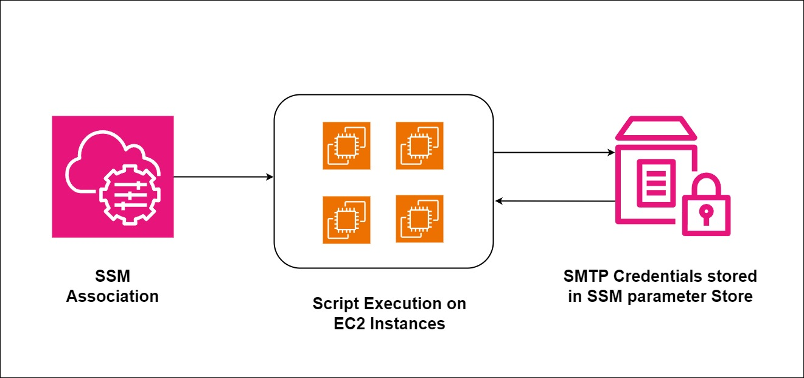
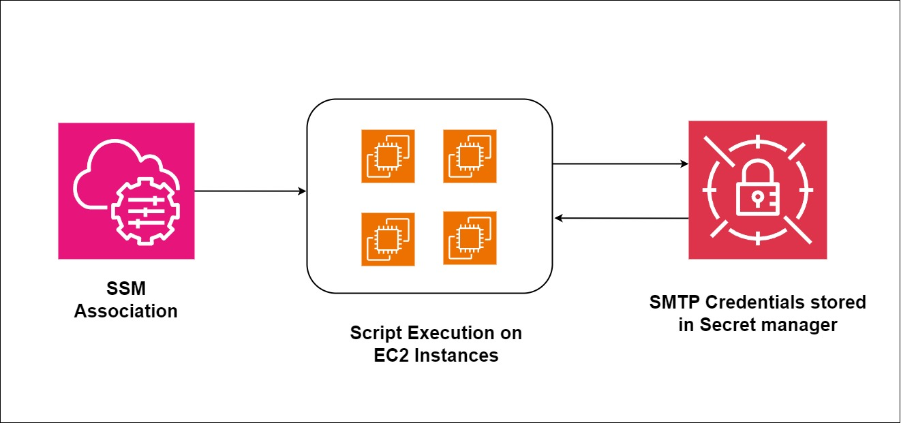

# AWS Postfix SES Credential Automation



## Overview

This project automates the process of updating Amazon SES (Simple Email Service) SMTP credentials on EC2 instances running Postfix. Manually updating credentials across multiple servers is error-prone and time-consuming; this solution leverages AWS Systems Manager (SSM) and AWS Secrets Manager (or Parameter Store) to ensure credentials remain synchronized and secure.

## Features

- **Automated Credential Rotation**: Automatically fetches the latest SES credentials from AWS Secrets Manager or SSM Parameter Store.
- **Postfix Configuration**: Updates `/etc/postfix/sasl_passwd`, generates the hash map (`sasl_passwd.db`), and reloads the Postfix service.
- **SSM Integration**: Designed to be executed via SSM Run Command or managed at scale through SSM State Manager Associations.
- **Notification**: Sends a confirmation email using `sendmail` once the update is successful.

## Architecture



The workflow follows these steps:
1. A new SES IAM user is created with SMTP permissions.
2. The SMTP credentials (Username/Password) are stored in **AWS Secrets Manager** (or **SSM Parameter Store**).
3. An **SSM Association** is configured to run the script on targeted EC2 instances.
4. The script:
   - Fetches credentials using the AWS CLI.
   - Updates Postfix SASL configuration.
   - Secures the credential files with appropriate permissions.
   - Reloads Postfix to apply changes.
   - Sends a test/notification email.

## Prerequisites

- **IAM Role**: EC2 instances must have an IAM role attached with the following permissions:
  - `secretsmanager:GetSecretValue` (for `sm-postfix.sh`)
  - `ssm:GetParameter` (for `ssm-postfix.sh`)
  - `ssm:UpdateInstanceInformation` and other standard SSM agent permissions.
- **AWS CLI**: Installed and configured on the target EC2 instances.
- **Postfix**: Installed and configured as a relay host on the instances.

## Usage

### 1. Store Credentials
Store your SES SMTP credentials in Secrets Manager or Parameter Store under the ID specified in the scripts (default: `ODS-6247`).

### 2. Run via SSM Run Command
You can manually trigger the update using the SSM Run Command:
```bash
aws ssm send-command \
    --document-name "AWS-RunShellScript" \
    --targets "Key=instanceids,Values=i-xxxxxxxxxxxxxxxxx" \
    --parameters '{"commands":["curl -s https://raw.githubusercontent.com/.../sm-postfix.sh | bash"]}' \
    --region us-west-2
```

### 3. Using SSM Association (State Manager)
To automate this at scale:
1. Go to **AWS Systems Manager > State Manager**.
2. Click **Create Association**.
3. Choose the `AWS-RunShellScript` document.
4. Provide the script execution command in the Parameters.
5. Select targets by tags (e.g., `Role: WebServer`).
6. Set a schedule (e.g., Cron or Rate) to ensure credentials stay updated.

## Script Variants

- **`sm-postfix.sh`**: Recommended. Fetches credentials from AWS Secrets Manager.
- **`ssm-postfix.sh`**: Alternative. Fetches credentials from AWS SSM Parameter Store.

## Security Note
The scripts automatically delete the plain-text `/etc/postfix/sasl_passwd` file after generating the `.db` hash map to minimize exposure of sensitive credentials on the file system.