# AWS Postfix SES Credential Automation


## Overview

This project automates the process of updating Amazon SES (Simple Email Service) SMTP credentials on EC2 instances running Postfix. Manually updating credentials across multiple servers is error-prone and time-consuming; this solution leverages AWS Systems Manager (SSM) and AWS Secrets Manager (or Parameter Store) to ensure credentials remain synchronized and secure.

## Features

- **Automated Credential Rotation**: Automatically fetches the latest SES credentials from AWS Secrets Manager or SSM Parameter Store.
- **Postfix Configuration**: Updates `/etc/postfix/sasl_passwd`, generates the hash map (`sasl_passwd.db`), and reloads the Postfix service.
- **SSM Integration**: Designed to be executed via SSM Run Command or managed at scale through SSM State Manager Associations.
- **Notification**: Sends a confirmation email using `sendmail` once the update is successful.

## Architecture

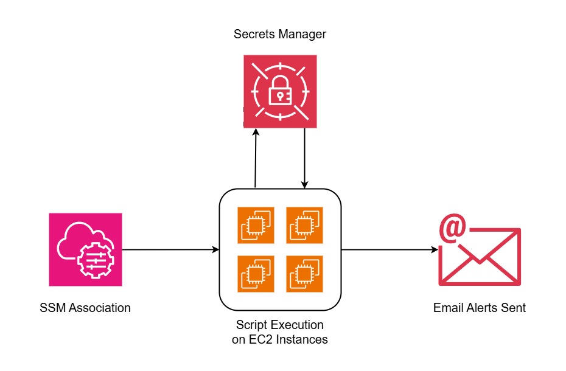

The workflow follows these steps:
1. A new SES IAM user is created with SMTP permissions.
2. The SMTP credentials (Username/Password) are stored in **AWS Secrets Manager** (or **SSM Parameter Store**).
3. An **SSM Association** is configured to run the script on targeted EC2 instances.
4. The script:
   - Fetches credentials using the AWS CLI.
   - Updates Postfix SASL configuration.
   - Secures the credential files with appropriate permissions.
   - Reloads Postfix to apply changes.
   - Sends a test/notification email.

## Prerequisites

- **IAM Role**: EC2 instances must have an IAM role attached with the following permissions:
  - `secretsmanager:GetSecretValue` (for `sm-postfix.sh`)
  - `ssm:GetParameter` (for `ssm-postfix.sh`)
  - `ssm:UpdateInstanceInformation` and other standard SSM agent permissions.
- **AWS CLI**: Installed and configured on the target EC2 instances.
- **Postfix**: Installed and configured as a relay host on the instances.

## Usage

### 1. Store Credentials
Store your SES SMTP credentials in Secrets Manager or Parameter Store under the ID specified in the scripts (default: `ODS-6247`).

### 2. Run via SSM Run Command
You can manually trigger the update using the SSM Run Command:
```bash
aws ssm send-command \
    --document-name "AWS-RunShellScript" \
    --targets "Key=instanceids,Values=i-xxxxxxxxxxxxxxxxx" \
    --parameters '{"commands":["curl -s https://raw.githubusercontent.com/.../sm-postfix.sh | bash"]}' \
    --region us-west-2
```

### 3. Using SSM Association (State Manager)
To automate this at scale:
1. Go to **AWS Systems Manager > State Manager**.
2. Click **Create Association**.
3. Choose the `AWS-RunShellScript` document.
4. Provide the script execution command in the Parameters.
5. Select targets by tags (e.g., `Role: WebServer`).
6. Set a schedule (e.g., Cron or Rate) to ensure credentials stay updated.


## Step By Step Workflow to perform this activity**

### **Step 1:**

Create a new SMTP User from SES Dashboard

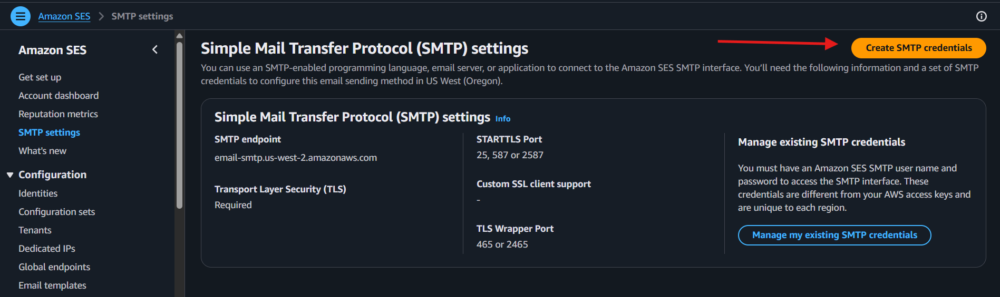

### **Step 2 :**

Make sure to use correct naming convention while creating the user  and click create user. 
Naming convention - usstg-ses-smtp-user-<dd-mm-yyyy> 

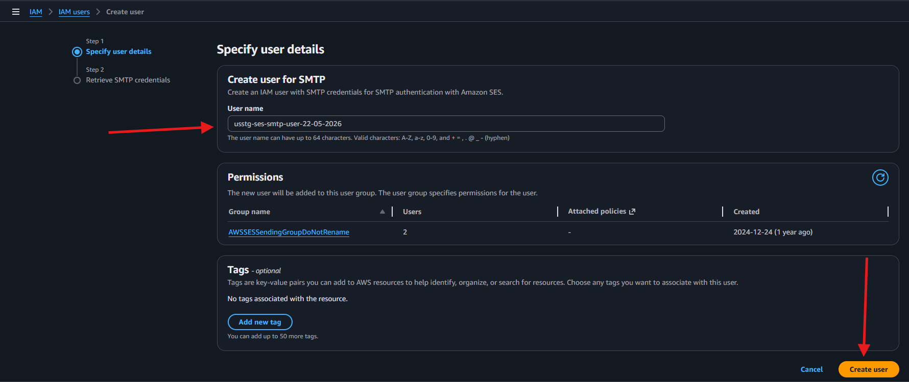

Do not close this window where it shows the credentials are created as we need to put these credentials in the secret manager
**Note:** Avoid saving these credentials on local machine from security perspective.

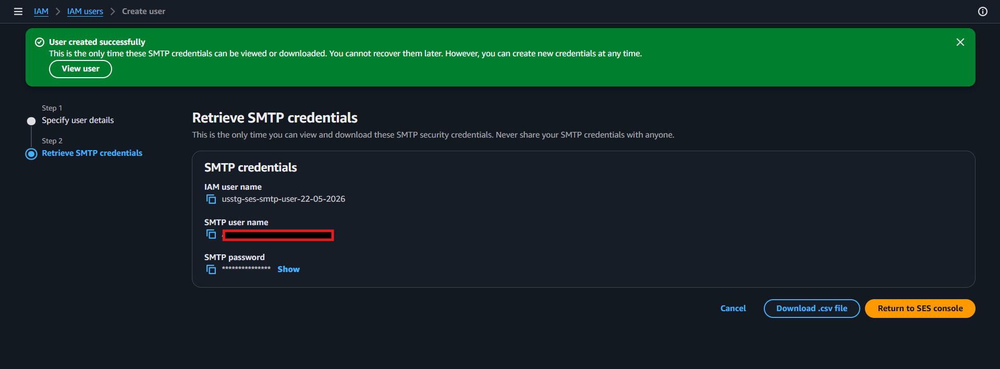

### Step 3 :

Update the secretes-manger with newer credentials

Secret Name - usstg-ses-smtp-user-credentials

Go to  secret and under the overview tab, click on retrieve secret

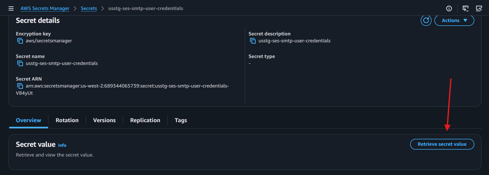

This will show you previously configured credential, we need to update the new ones here.
Click the edit button right next to it.

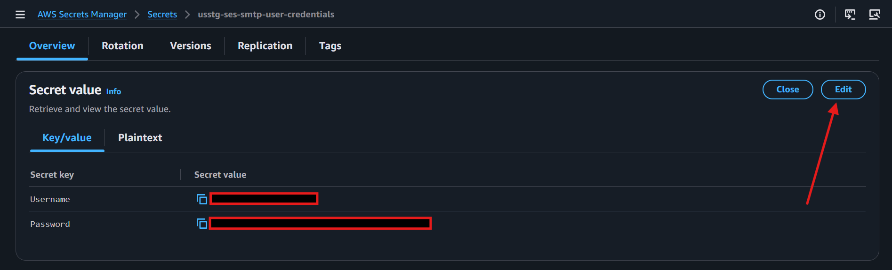

Copy paste the newly created credentials and save them

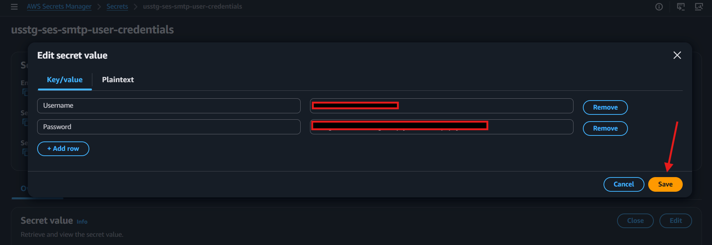

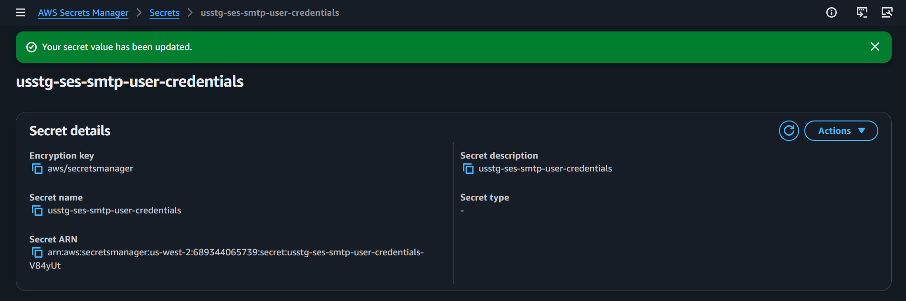

### Step 4 :

Go to the SSM Association and Apply association -  
Name: usstg-ses-smtp-credentials-rotation 
Association ID - de12439c-cca3-40ea-80c1-ea09c809c668


Once the SSM Association is applied, go back to the association and check the execution history tab

It should show success, if there is any error in the association, in that case we have to follow certain steps which will be defined in later steps below.

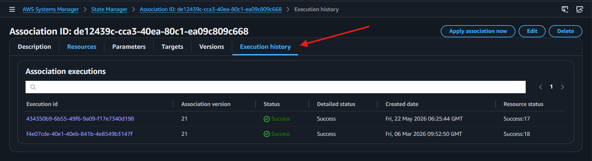

**Note:**  Just FYI, the SSM Association is created to target instances on tags based. 
So if there are any servers that have the following tags attached to them, their smtp credentials will be updated. 

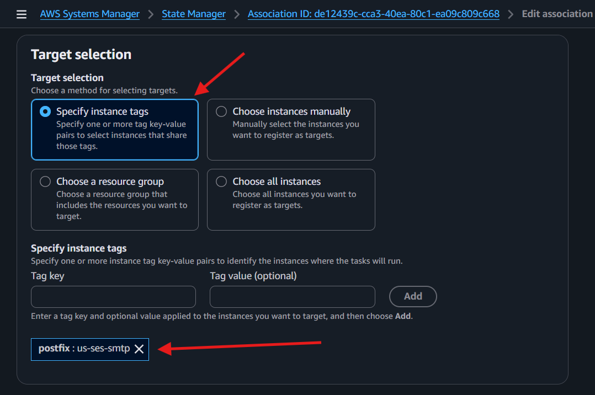

### Step 5 :

Check if the SMTP Credential update activity is done properly, 
We can confirm this by checking the email alerts of all the ec2 servers.
Make Sure to match the alerts for all servers mentioned in above section of the runbook. 


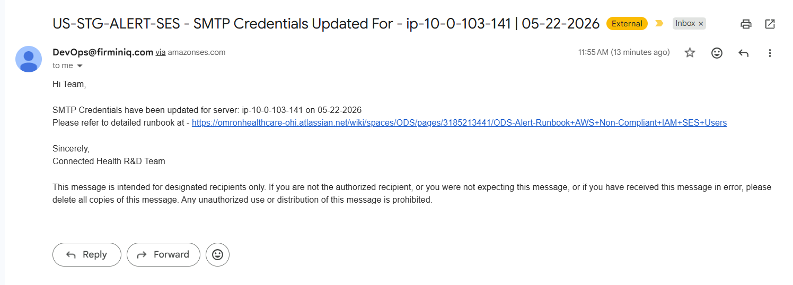

**Note:** If any of the server was in stopped state during this process, no need to panic as SSM Association keeps that script execution in pipeline for pending servers and the moment they start, the script gets executed on them and we can see an email alert being received for the server as well.

We started these two servers after applying the ssm association and we have received their confirmation alerts as well.


### Step 6 :

Once the smtp credentials are updated on all servers and verified, 
We need to then remove the previously created user which was created during last activity.

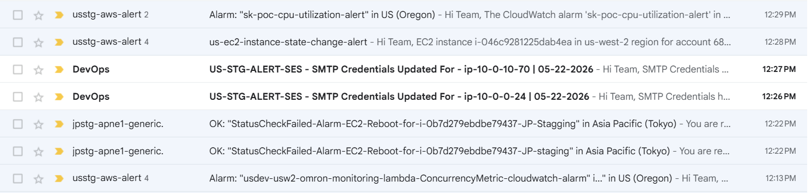

AWS will prompt you to first deactivate the access keys to delete the old user, 
Click deactivate keys.

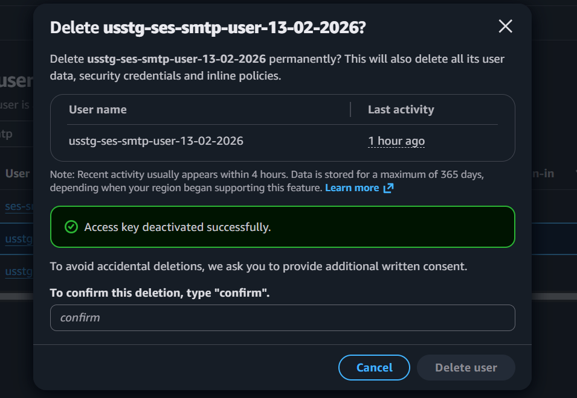

Once the access key is deactivated, confirm and delete the user.

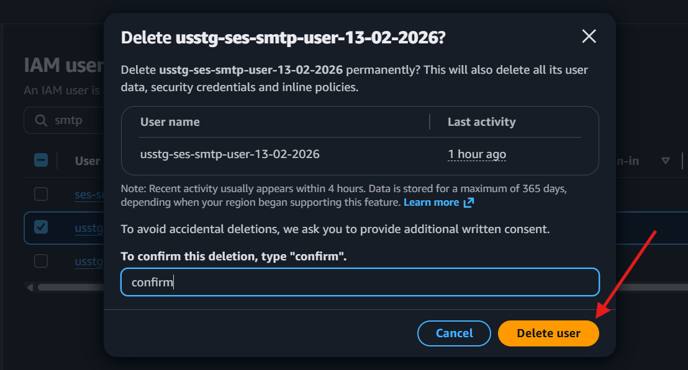

Finally we can see our latest keys are working fine

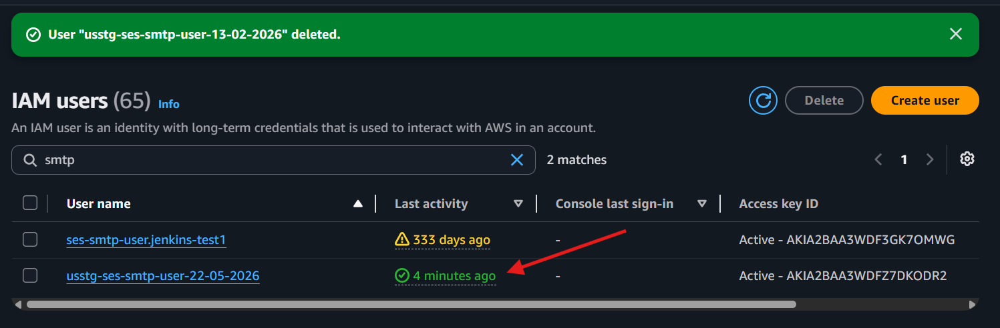

## Precautionary Measure

We also have a recovery scritp for which we can create another SSM association which can be executed if the main setup script fails to update the new credentials. This recovery script recovers the previously applied credentials which was backed up right when the main script starts.

## Security Note
The scripts automatically delete the plain-text `/etc/postfix/sasl_passwd` file after generating the `.db` hash map to minimize exposure of sensitive credentials on the file system.